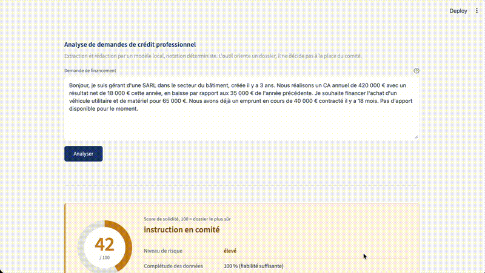

# Analyse de demandes de crédit professionnel

Outil interne qui transforme une demande de financement en texte libre, copiée
depuis un email, en fiche de synthèse avec score de risque et recommandation.

Tout tourne en local. Aucune donnée client ne sort de la machine.

---

## Démo



**En entrée**, une demande de financement en texte libre, telle qu'elle arrive
par email ou par formulaire :

> Bonjour, je suis gérant d'une SARL dans le secteur du bâtiment, créée il y a
> 3 ans. Nous réalisons un CA annuel de 420 000 € avec un résultat net de
> 18 000 € cette année, en baisse par rapport aux 35 000 € de l'année
> précédente. Je souhaite financer l'achat d'un véhicule utilitaire et de
> matériel pour 65 000 €. Nous avons déjà un emprunt en cours de 40 000 €
> contracté il y a 18 mois. Pas d'apport disponible pour le moment.

**En sortie**, une fiche de synthèse :

- un score de solidité sur 100, avec le niveau de risque et la recommandation
- les points forts et les points de vigilance du dossier, chiffrés
- les hypothèses retenues quand une donnée manque, et les pièces à réclamer
  pour les lever
- le détail de chaque critère, avec sa valeur et son appréciation

Les données extraites restent éditables : corriger une valeur mal lue ou
saisir une donnée manquante met le score à jour instantanément, sans nouvel
appel au modèle.

---

## Stack

| Brique | Choix | Pourquoi |
|---|---|---|
| Modèle | Ollama, llama3.1:8b, en local | Données bancaires nominatives, rien ne sort de la machine |
| Client LLM | `urllib`, bibliothèque standard | Aucun SDK de fournisseur, 30 lignes suffisent |
| Scoring | Python pur, sans dépendance | Reproductible et testable en une seconde |
| Interface | Streamlit | Le plus court chemin vers une démo utilisable |
| Tests | pytest | Le moteur ne fait aucun appel réseau |
| Développement | Claude Code | Itérations documentées dans `prompts.md` |

Trois dépendances au total : `streamlit`, `pytest`, et Ollama.

---

## Comment ça marche

| Étape | Qui fait quoi |
|---|---|
| 1. Extraction | Un LLM local lit le texte et sort un JSON structuré |
| 2. Scoring | Le code calcule le score, avec des règles déterministes |
| 3. Rédaction | Le LLM écrit la synthèse, à partir du score déjà calculé |

**Le LLM ne calcule jamais le score.** Un score bancaire doit donner le même
résultat à chaque lancement, et pouvoir s'expliquer ligne par ligne. Le
classement des critères en points forts et points de vigilance est lui aussi
fait par le code, pour la même raison.

Le score va de 0 à 100. Plus il est haut, plus le dossier est solide.

| Score | Recommandation |
|---|---|
| 75 à 100 | Accord de principe |
| 60 à 74 | Accord sous conditions |
| 40 à 59 | Instruction en comité |
| 0 à 39 | Analyse renforcée, avis défavorable en l'état |

Aucun refus automatique : l'outil oriente un dossier, un humain décide.

---

## Installation

Prérequis : Python 3.10 ou plus, et [Ollama](https://ollama.com).

```bash
git clone https://github.com/VOTRE-PSEUDO/credit-scoring.git
cd credit-scoring

python3 -m venv .venv
source .venv/bin/activate
pip install -r requirements.txt

ollama pull llama3.1:8b
```

---

## Lancer

Dans un premier terminal, le serveur de modèle :

```bash
ollama serve
```

Dans un second, l'interface :

```bash
source .venv/bin/activate
python -m streamlit run app.py
```

L'application s'ouvre sur http://localhost:8501, pré-remplie avec la demande
d'exemple ci-dessus.

---

## Utiliser sans interface

```bash
python extraction.py   # texte vers JSON
python scoring.py      # JSON vers score
python report.py       # pipeline complet, fiche en JSON
```

En Python :

```python
from extraction import extract
from scoring import compute_score
from report import write_report

data = extract("Bonjour, je suis gérant d'une SARL...")
fiche = write_report(data, compute_score(data))
```

---

## Fichiers

| Fichier | Rôle |
|---|---|
| `app.py` | Interface Streamlit |
| `extraction.py` | Texte libre vers JSON structuré |
| `scoring.py` | Grille de risque : critères, seuils, poids |
| `report.py` | Classement des points et rédaction de la fiche |
| `llm.py` | Client Ollama minimal |
| `prompts.md` | Carnet de bord : itérations, blocages, décisions |
| `tests/` | Tests du moteur de scoring |

---

## Configurer

Le modèle et l'adresse du serveur se règlent par variables d'environnement :

```bash
export OLLAMA_MODEL=qwen2.5:14b
export OLLAMA_BASE_URL=http://localhost:11434
```

Les seuils et les poids de la grille sont regroupés en haut de `scoring.py`,
dans `WEIGHTS` et `THRESHOLDS`. Aucune valeur n'est écrite en dur dans les
fonctions.

---

## Tests

```bash
pytest -v
```

---

## Limites connues

- **Crédit professionnel uniquement.** Une demande immobilier ou consommation
  renvoie « grille non applicable » plutôt qu'un score qui ne voudrait rien
  dire.
- **Déclaratif.** Aucune pièce justificative n'est vérifiée. Des contrôles de
  plausibilité attrapent les erreurs d'extraction grossières, sans remplacer
  une vérification humaine.
- **Seuils non calibrés.** Les poids, les coefficients de secteur et le
  facteur d'estimation de la CAF sont des hypothèses de travail, pas des
  valeurs issues de données de défaut observées.